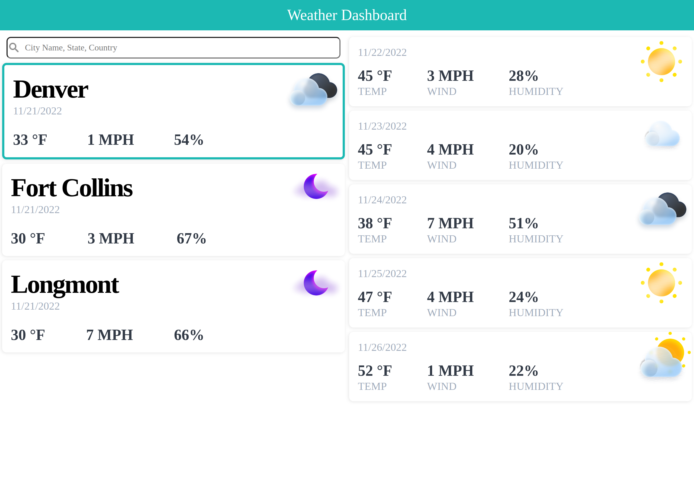

# wk6c-weather-dashboard

## Description

The weather dashboard provides the user with a way to search for the current and 5-day weather forecasts for any city in the United States. The city latitude/longitude as well as the current weather data are stored in the users localStorage. The site checks local storage on load for any saved city location data so the geocoding API only needs to be used when a new city's weather data is needed. It also stores current weather and displays it at all times on the city cards to the user. The weather data is saved with the city in localStorage so repeated page reloads will not continually request data from the API.

## Installation

N/A

## Usage

By entering a city name followed by a comma and state code, the user can view the current weather and 5-day forecast for that city. The site will add that city to the list of cities. The user can click on any city previously searched to see the 5-day forecast for that city. The city history is stored locally.

Deployed Page: https://josht-dev.github.io/wk6c-weather-dashboard/

## Credits

N/A

## License

Refer to the LICENSE in the repo for the code. 
The font (Montserrat) is licensed under the SIL Open Font License (OFL).
